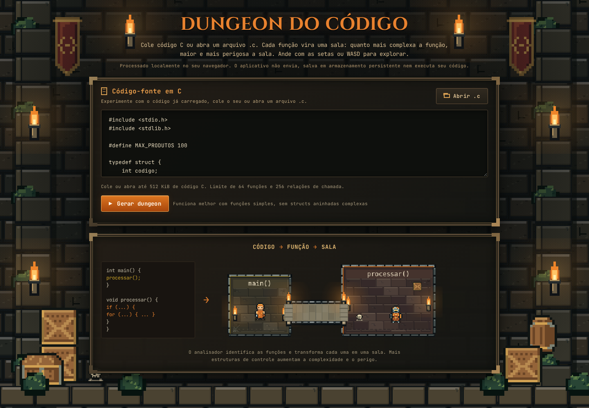
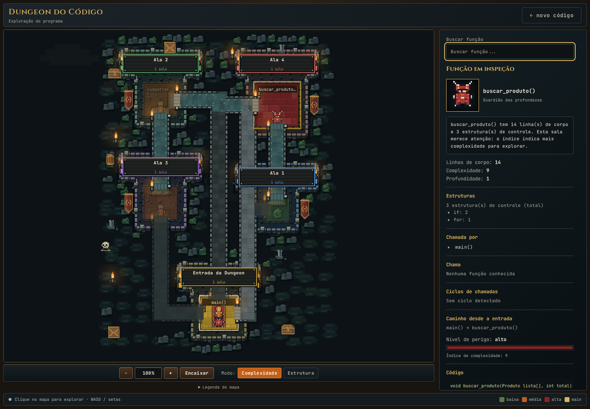

# Dungeon do Código

Transforma código C em uma dungeon explorável no navegador: cada função vira uma sala, e chamadas entre funções conhecidas formam corredores. O mapa permite explorar a estrutura do programa e consultar o código e as métricas de cada função.

**[Abrir a demonstração](https://dungeon-do-codigo.pages.dev/)**

O projeto nasceu da ideia de combinar leitura de código, visualização de software e exploração em uma interface inspirada em jogos. Ele analisa o código como texto: **não compila nem executa C**.

## As duas telas

A tela de entrada permite editar o exemplo inicial, colar código ou importar um arquivo `.c`.



Na exploração, o mapa e o painel de inspeção mostram funções, estruturas de controle e relações de chamada.



As capturas são da versão publicada no Cloudflare Pages, usando o exemplo inicial.

## Como experimentar

1. Abra a [demonstração](https://dungeon-do-codigo.pages.dev/).
2. Use o exemplo já preenchido ou cole seu código C. Também é possível abrir ou arrastar um arquivo `.c` para o editor.
3. Clique em **Gerar dungeon**.
4. Explore o mapa, selecione uma sala ou busque uma função pelo nome.
5. Use **novo código** para voltar ao editor; seu texto permanece disponível.

| Controle | Ação |
| --- | --- |
| Clique em uma sala | Seleciona a função e atualiza o painel, sem mover o personagem |
| Duplo clique em uma sala | Inicia a caminhada automática se houver uma rota física válida |
| WASD ou setas, com o mapa ativo | Move o personagem; movimento manual cancela a rota automática |
| `Esc` ou foco fora do mapa | Libera o teclado e interrompe o movimento manual |
| Roda do mouse sobre o mapa | Desloca a câmera verticalmente |
| `Shift` + roda | Desloca a câmera horizontalmente |
| `−`, percentual e `+` | Afasta, restaura 100% e aproxima o zoom |
| **Encaixar** | Mostra uma visão geral da dungeon |
| **Complexidade / Estrutura** | Alterna a apresentação sem modificar o grafo ou o mapa |
| Busca e botões de chamadas no painel | Selecionam funções relacionadas |
| **Legenda do mapa** | Expande a explicação dos marcadores e passagens |

A exploração foi pensada para computador, com teclado e mouse. A interface se adapta a janelas estreitas, mas ainda não possui controles de movimento por toque.

## O que o mapa representa

- **Salas:** funções encontradas no código.
- **Corredores semânticos:** chamadas entre funções conhecidas. A direção da chamada aparece nos dados do painel; o personagem pode percorrer o caminho nos dois sentidos.
- **Galerias de exploração:** passagens adicionais para circulação física. Não acrescentam chamadas ao programa.
- **Regiões:** Entrada da Dungeon, Salão Central, Alas e Criptas Isoladas, classificadas a partir do grafo.
- **Painel de inspeção:** código original, linhas de corpo, estruturas de controle, callers, callees, profundidade, ciclos, recursão e caminho desde a entrada.

Quando existe `main`, ela é a entrada. Caso contrário, a primeira função encontrada assume esse papel. Uma função isolada pode ser visitável fisicamente e continuar inalcançável no grafo. Cruzamentos visuais independentes também não criam conexões.

### Índice de complexidade

A fórmula atual é uma heurística própria:

```text
complexidade = 2 × estruturas de controle + piso(linhas de corpo / 4)
```

São contadas ocorrências de `if`, `for`, `while`, `switch` e `case` no código estrutural, desconsiderando comentários e literais. As linhas de corpo são as linhas não vazias do corpo após remover comentários. As cores e criaturas usam essa pontuação: até 2, baixa; de 3 a 6, média; acima de 6, alta.

Esse índice **não é complexidade ciclomática nem uma avaliação de segurança do código C**. O “perigo” é parte da linguagem visual da dungeon.

## Privacidade e limites

O processamento acontece no navegador, em um Worker local. O aplicativo não transmite o código, não o salva em armazenamento persistente e não exige conta. A hospedagem recebe as requisições dos arquivos do site e pode manter registros de acesso.

| Limite da versão atual | Valor |
| --- | --- |
| Texto colado ou arquivo importado | 512 KiB em bytes UTF-8 |
| Importação | Um arquivo `.c` por vez |
| Funções | 64, com nomes únicos de até 128 caracteres |
| Relações de chamada | 256 pares distintos de origem e destino |
| Prazo da preparação | 8 segundos, incluindo o carregamento dos módulos |
| Dimensões do mapa | Até 8.192 unidades por dimensão e 6.000.000 unidades quadradas |
| Segmentos navegáveis | 2.048 |

A preparação pode ser cancelada; editar a entrada também cancela a tentativa atual. Entradas que excedem os limites recebem uma mensagem. Fontes e módulos são locais, e a hospedagem aplica CSP e cabeçalhos de segurança.

Veja [SECURITY.md](SECURITY.md) para os controles, a privacidade e o relato de problemas. Os testes fornecem evidências sobre comportamentos específicos, sem garantir segurança absoluta.

## Executar localmente

Requisitos: Python 3 para o servidor local; Node.js 24 para reproduzir os testes do CI. A aplicação usa HTML, CSS, JavaScript ES Modules e Canvas 2D, sem framework ou dependências npm de produção.

```bash
git clone https://github.com/murilo-mg/dungeon-do-codigo.git
cd dungeon-do-codigo
python3 -m http.server 8000
```

Abra [http://localhost:8000](http://localhost:8000). Use um servidor HTTP: abrir `index.html` diretamente por `file://` não é suficiente para módulos e Worker.

Não é necessário executar `npm install` para abrir a aplicação ou rodar a suíte atual.

## Testes

Na raiz do projeto:

```bash
npm test
```

Na revisão da publicação: **367 testes passando, nenhum falhando**. A suíte cobre análise, grafo, regiões, layout, corredores, colisão, navegação, câmera, interface, importação, limites, cancelamento e transporte pelo Worker. O GitHub Actions executa os testes em pushes e pull requests; a `main` exige PR e o check `testes`.

As verificações da versão hospedada e a configuração do Cloudflare Pages estão em [docs/PUBLICACAO.md](docs/PUBLICACAO.md).

## Limitações conhecidas

O analisador reconhece um subconjunto de C e não substitui um compilador. Macros complexas, pré-processamento condicional, ponteiros de função e declarações avançadas podem produzir análise parcial. Chamadas externas, como `printf`, não viram salas.

O layout é determinístico, mas programas densos ainda podem produzir encontros de caminhos difíceis de ler. Galerias não são forçadas quando não existe um desvio físico seguro. A colisão representa a base do personagem; a parte superior do sprite pode se projetar visualmente sobre paredes.

## Organização do código

| Área | Módulos principais |
| --- | --- |
| Validação e análise de C | `entradaCodigo.js`, `lexicoC.js`, `analisadorC.js` |
| Grafo e regiões semânticas | `grafoC.js`, `regioesMasmorra.js` |
| Layout e construção | `layoutMasmorra.js`, `layoutRegioes.js`, `masmorra.js` |
| Caminhos, colisão e navegação | `corredores.js`, `circulacaoDungeon.js`, `areaCaminhavel.js`, `navegacaoMasmorra.js` |
| Preparação em segundo plano | `processadorDungeon.js`, `dungeonWorker.js`, `processamentoDungeon.js`, `preparacaoDungeon.js` |
| Jogo e apresentação | `jogo.js`, `camera.js`, `zoomDiscreto.js`, `semanticaVisual.js`, `desenhoMasmorra.js`, `cenario.js`, `aderecosDungeon.js`, `entradaDungeon.js`, `personagem.js`, `criaturas.js`, `efeitos.js`, `pixelArt.js` |
| Interface e integração | `interface.js`, `principal.js` |
| Estilos e fontes locais | `css/estilo.css`, `css/fontes.css`, `assets/fontes/` |

Os módulos ficam em `js/`. Testes ficam em `testes/`; capturas e documentação ficam em `docs/`. `_headers` configura as respostas HTTP no Cloudflare Pages. As licenças das fontes estão em [assets/fontes/](assets/fontes/).

## Documentação e próximos ciclos

- [Estado atual](docs/ESTADO_ATUAL.md): comportamento funcional e técnico.
- [Arquitetura](docs/ARQUITETURA.md): módulos, responsabilidades e fluxo dos dados.
- [Decisões](docs/DECISOES.md): regras arquiteturais adotadas.
- [Plano técnico](docs/PLANO_TECNICO.md): trabalho ainda planejado.
- [Publicação](docs/PUBLICACAO.md): hospedagem, capturas e validação da versão ao vivo.
- [Evolução](EVOLUCAO.md): histórico dos marcos concluídos.
- [Correções](CORRECOES.md): registro histórico de uma revisão de bugs.

A baseline `v0.1.0`, a consolidação das duas telas e a revisão de segurança já estão integradas à `main`. Os próximos ciclos priorizam explicar melhor a análise, avisar sobre construções parcialmente suportadas, adicionar exemplos e melhorar acessibilidade. Exportação e atividades de leitura de código permanecem como evoluções futuras.

> Se um significado visual não puder ser justificado pelos dados analisados, ele não deve ser apresentado como fato.
